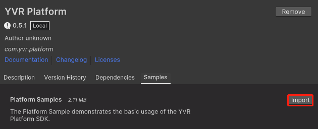
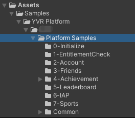
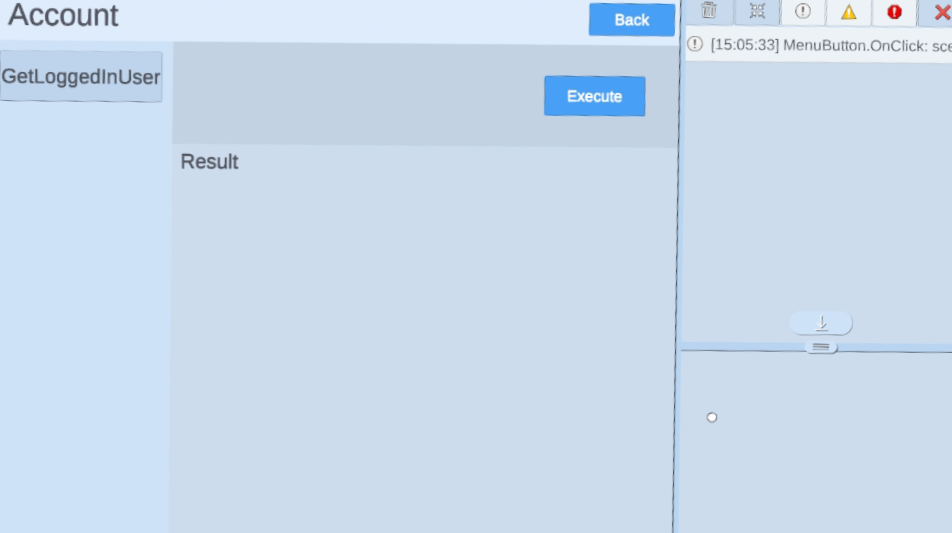
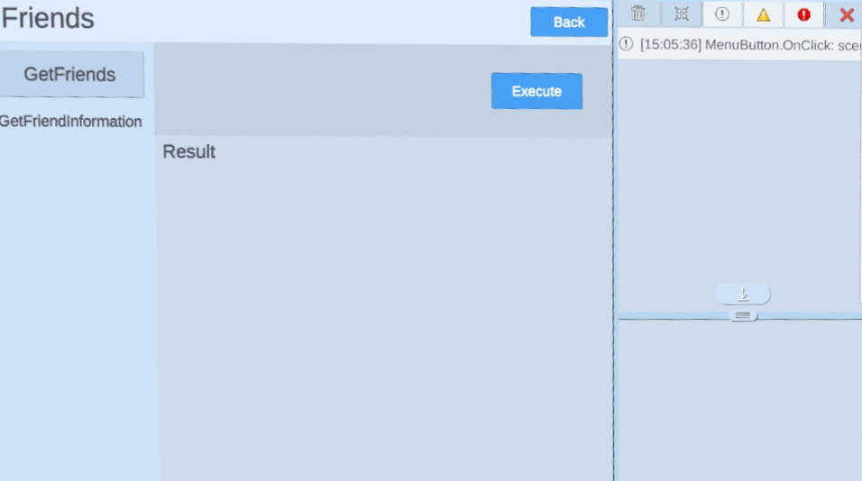

# 账号与好友

> [!Important]
> 在使用任何平台功能之前，开发者首先需要初始化 Platform SDK。更多详情，请参考 [Platform](./Platform.md)。

## 好友

用户可以在你的应用程序中看到朋友信息。

以下 SDK 方法可以从您的客户端应用程序中调用：

1. `YVR.Platform.Friends.GetFriends`：检索所有用户的朋友信息。
2. `YVR.Platform.Friends.GetFriendInformation`：检索具有账户 ID 的指定朋友的信息。

> [!NOTE]
> 更多信息，请参考 [Friends API Documentation](xref:YVR.Platform.Friend)。

## 账号

当用户打开你的应用程序，你可以在的应用程序中获得用户的账户信息。

1. `YVR.Platform.Account.GetLoggedInUser`：获取已登录用户的账户信息。

> [!NOTE]
> 更多信息，请参考 [Account API Documentation](xref:YVR.Platform.Account)。

## 示例

> [!Important]
> YVR 系统版本要求：1.2.6 及以上版本

请按照步骤导入示例项目。[平台示例](https://github.com/YVRDeveloper/PlatformSample-Unity)也可从 [YVR Developer Github](https://github.com/YVRDeveloper)获取。

1. 导入平台 SDK。 

2. 进入 **Window** > **Package Manager** > **Platform** > **Samples**，点击 **Import** 按钮导入平台示例。
     
    

3. 在 **Project** 面板下，进入 **Assets** > **Samples** > **YVR Platform** > *[**platform version number**]*。选择 **Account/Friends** 文件夹下查看示例。 
     
    
     
    > [!Note]
    > 平台版本号取决于导入的版本，例如 0.5.1。

4. 构建并安装示例项目在 YVR 设备上。
     
    
      
    