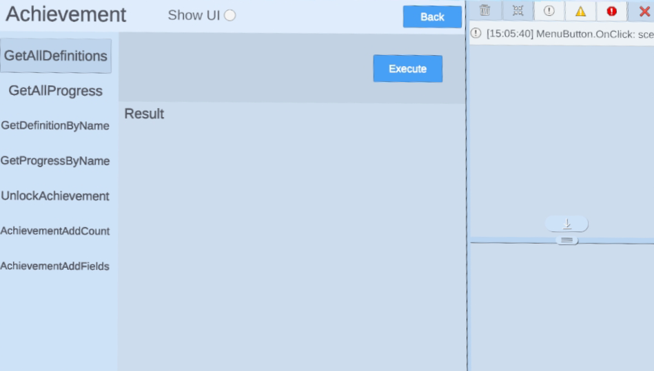

# 成就

> [!Important]
> 在使用任何平台功能之前，开发者首先需要初始化 Platform SDK。更多详情，请参考 [Platform](./Platform.md)。

## 整合成就

在你创建完成就后，你可以把它们整合到你的游戏中。当你调用这部分的函数时，请确保使用你在开发者仪表板上指定的成就名称。

1. `YVR.Platform.GetDefinitionsByName`：检索特定成就信息，包括成就名称、类型、目标或比特域长度。
2. `YVR.Platform. GetProgressByName`：检索用户在特定成就上的进展信息；包括名称、解锁状态、成就解锁时间、当前位域和当前计数。
3. `YVR.Platform.GetAllDefinitions`：检索所有成就信息；包括成就名称、类型、目标或位域长度。
4. `YVR.Platform.GetAllProgress`：检索所有成就信息，包括成就名称、类型、目标或位域长度。检索用户在所有成就上的进展信息；包括名称、解锁状态、成就解锁时间、当前比特域和当前计数。

以下 SDK 方法可以为任何具有客户端授权写入策略的成就调用。

1. `YVR.Platform.UnlockAchievement`: 解锁一个指定成就。这将完全解锁一个成就，包括计数和比特字段成就，即使没有达到目标。
2. `YVR.Platform.AchievementAddCount`: 增加计数成就的计数。
3. `YVR.Platform.AchievementAddFields`: 解锁位域类型成就中的一个位。

> [!NOTE]
> 更多信息，请参考 [Achievement API Documentation](xref:YVR.Platform.Achievement)。

## 示例

> [!Important]
> YVR 系统版本要求：1.2.6 及以上版本

请按照步骤导入示例项目。[平台示例](https://github.com/YVRDeveloper/PlatformSample-Unity)也可从 [YVR Developer Github](https://github.com/YVRDeveloper)获取。

1. 导入平台 SDK。 

2. 进入 **Window** > **Package Manager** > **Platform** > **Samples**，点击 **Import** 按钮导入平台示例。
     
    

3. 在 **Project** 面板下，进入 **Assets** > **Samples** > **YVR Platform** > *[**platform version number**]*。选择 **Achievement** 文件夹下查看示例。 
     
    
     
    > [!Note]
    > 平台版本号取决于导入的版本，例如 0.5.1。

4. 构建并安装示例项目在 YVR 设备上。
     
    