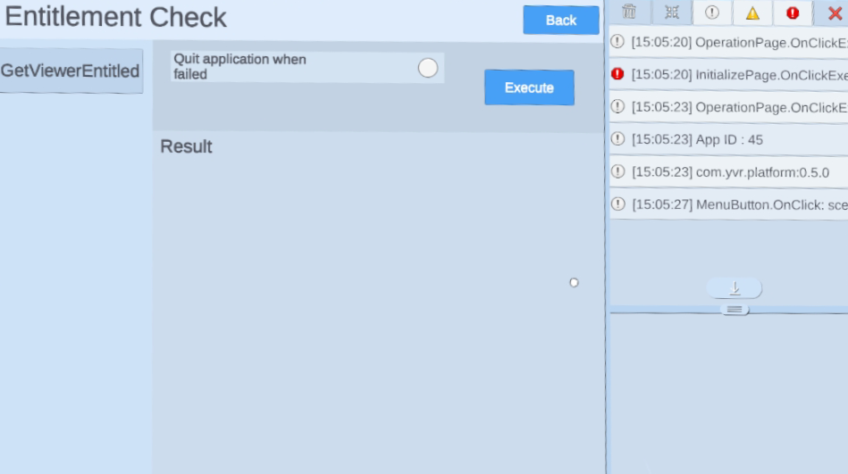

# 鉴权

> [!Important]
> 在使用任何平台功能之前，开发者首先需要初始化 Platform SDK。更多详情，请参考 [Platform](./Platform.md)。

鉴权是用来检查当前设备用户是否已购买或拥有你的应用程序。

为了满足 YVR 的发布要求，开发者必须在程序启动后 10 秒内进行检查。关于发布要求的更多细节，请参考  [VRC Requirements](https://developer.yvr.cn/yvrdoc/vrce/articles/Security1.html)。

> [!NOTE]
> 这个检查并不强迫用户在使用该应用程序时必须在线。即使设备处于离线状态，只要设备在 30 天内处于在线的状态，检查结果也是正确的。

## 执行鉴权

`GetViewerEntitled` 是一个异步接口，用于检查鉴权状态：

```csharp
YVR.Platform.PlatformCore.GetViewerEntitled().OnComplete(GetViewerEntitledCallback);

private void GetViewerEntitledCallback(YVR.Platform.YVRMessage<YVR.Platform.Entitlement> msg)
{
    if (msg.isError || !msg.data.isEntitled)
    {
        // Entitlement check failed. Quit app.
    }
}
```


## 示例

> [!Important]
> YVR 系统版本要求：1.2.6 及以上版本

请按照步骤导入示例项目。[平台示例](https://github.com/YVRDeveloper/PlatformSample-Unity)也可从 [YVR Developer Github](https://github.com/YVRDeveloper)获取。

1. 导入平台 SDK。 

2. 进入 **Window** > **Package Manager** > **Platform** > **Samples**，点击 **Import** 按钮导入平台示例。
    <br />
    

3. 在 **Project** 面板下，进入 **Assets** > **Samples** > **YVR Platform** > *[**platform version number**]*。选择 **EntitlementCheck** 文件夹下查看示例。 
    <br />
    
    <br />
    > [!Note]
    > 平台版本号取决于导入的版本，例如 0.5.1。

4. 构建并安装示例项目在 YVR 设备上。
    <br />
    
