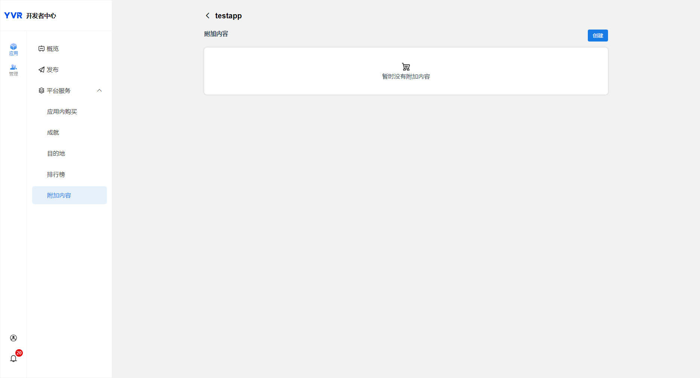
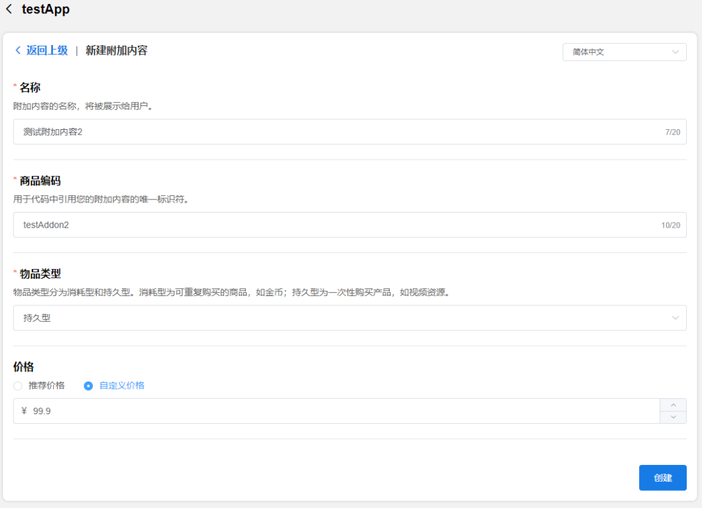
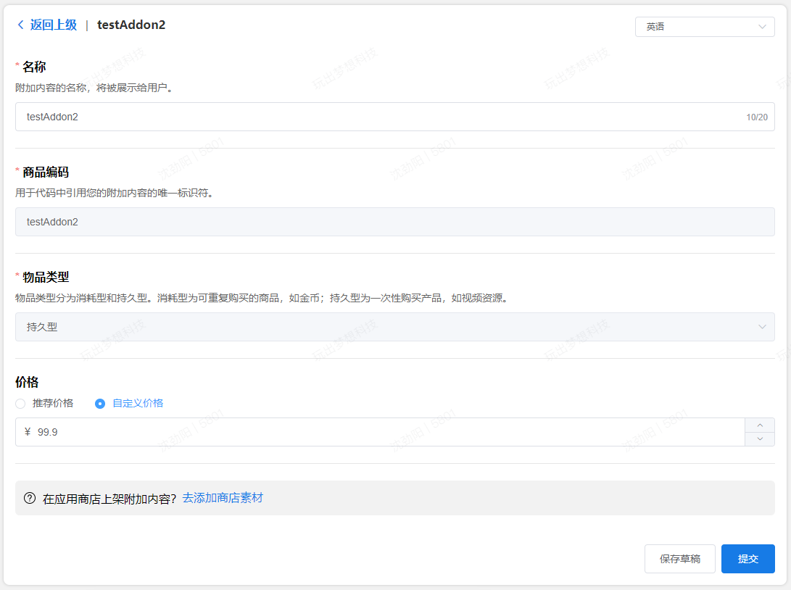
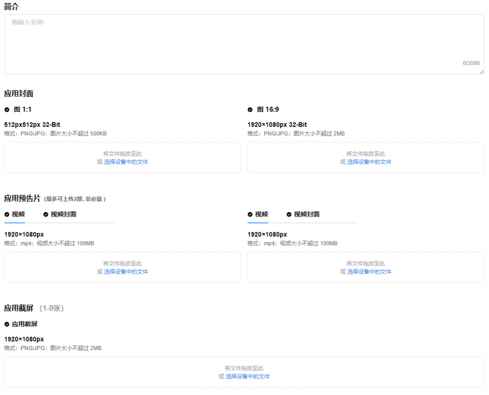

# 内购客户端 API

> [!Important]
> 在使用任何平台功能之前，开发者首先需要初始化 Platform SDK。更多详情，请参考 [Platform](./Platform.md)。

YVR 支付是一个基于 YVR 账户系统的当前支付系统。支付结算由 YVR 的游戏货币（Y币）完成。用户需要进入 YVR 用户中心为其账户充值。

> [!Note]
> 对于中国大陆地区，若应用类型为“游戏”且未取得版号，则无法在应用中使用内购服务。非中国大陆地区可正常使用。

> [!Note]
> Unity SDK 2.3.0 之前版本支持的内购服务已弃用，请尽快迁移到新版内购功能。更多详情，请查阅应用[内购](./IAPClient.md)。

## 内购功能

| **名称**                | **说明**                                                                            |
|-----------------------|-----------------------------------------------------------------------------------|
| Add-on                | 附加内容，可以在应用内和 YVR 应用商店出售，前者可称为内购。                                                  |
| In-App Purchase (IAP) | 应用内购，在游戏中购买游戏道具、虚拟货币或其他增值服务。购买的对象是附加内容。                                           |
| Consume               | 消耗型商品购买后的履约过程。例如，当用户购买了100个金币并成功充值到其账户后，我们将视为“履约完成”。消耗型商品履约完成后，用户才能再次购买该商品。       |
| SKU                   | 商品码，为附加内容的唯一标识。                                                                   |
| DLC                   | DLC（Downloadable Content）是指可下载的额外内容，通常是游戏中的扩展内容、附加物品或补充包，通过下载添加到游戏中。DLC 和附加内容相关联。 |

## 创建附加内容

1. 登入[开发者中心](https://developer.pfdm.cn/yvrdev/all_apps)。

2. 点击已创建应用，选择 **应用 > 平台服务 > 附加内容**。

   

3. 点击创建，将看到新建附加内容的窗口。

    - **名称**：附加内容的名称，将被展示给用户。

    - **商品编码**：用于代码中引用您的附加内容的唯一标识符。

    - **物品类型**：类型分为消耗型和持久型。消耗型为可重复购买的商品，如金币；持久型为一次性购买产品，如视频资源。

    - **价格**：可选择推荐价格和自定义价格，保留一位小数。

   

4. 点击创建。附加列表中将显示所创建的附加内容，提交状态为草稿，发布状态为待发布。

5. 在附加列表中，点击目标附加内容的名称或点击编辑按钮，进入该附加内容的信息编辑页。

   

6. 编辑附加内容信息。名称和价格可修改。

7. 持久型物品可在应用商店上架并销售，点击“去添加商店素材”后补充如下素材：

   

8. 点击提交。提交后，附加内容将进入审核流程。审核通过后，您可自行发布/下架附加内容，只有发布状态为“已发布”的附加内容可被用户查看和购买。

## 编辑附加内容

附加内容审核通过后，若你需要编辑附加内容的信息或调整上架商店状态，可执行如下操作：

1. 编辑目标附加内容，进入编辑页。

2. 修改附加内容的信息。

3. 点击提交后，进入修改审核流程，原审核通过的附加内容持续生效，直至当前修改审核通过，信息和上架商店状态将自动更新。

## 接口信息

| **接口**             | **详情**                                                                                                                                                                                | 
|:-------------------|:--------------------------------------------------------------------------------------------------------------------------------------------------------------------------------------|
| GetProductsBySku   | 获取可购买商品列表。                                                                                                                                                                            |
| LaunchCheckoutFlow | 发起购买流程，需调用 GetProductsBySKU 接口获取上述信息。                                                                                                                                                 |
| GetViewerPurchases | 获取已购买商品列表。完成购买流程后，你可以调用 GetViewerPurchases 接口来向用户展示已购买的商品列表，包括永久型商品和尚未履约的消耗型商品。                                                                                                       |
| ConsumePurchase    | 履约已购买商品。对于消耗型商品，你需要在自己的业务服务端实现履约逻辑。以游戏金币为例，若你添加的商品为“10 个金币”，用户购买该商品后，后台须向指定用户的帐号充值 10 金币。你可以调用 ConsumePurchase 接口来记录履约结果。履约后，GetViewerPurchases 接口将不再返回该商品。在之前的订单完成之前，用户无法重新购买相同的消耗型。 |
| StartMovie         | 标记视频已开始观看                                                                                                                                                                             |

### 内购商品

`YVR.Platform.IAPProduct` 提供商品信息，包含以下属性：

| **IAPProduct** | **类型** | **定义**                             |
|:---------------|:-------|:-----------------------------------|
| appID          | long   | 应用ID                               |
| sku            | string | 商品唯一识别号                            |
| name           | string | 商品名称                               |
| description    | string | 商品信息                               |
| icon           | string | 商品图标                               |
| addOnType      | int    | 商品类型 1: 消耗品, 2: 持久型, 3: 非续订订阅型(影片) |
| price          | float  | 商品价格                               |
| currency       | int    | 商品货币类型 0: 人民币, 1: 美元               |

### 订单商品

`YVR.Platform.IAPPurchasedProduct` 提供已购买的商品信息。
`YVR.Platform.IAPPurchasedProductList` 提供所有购买的商品数据。

一个已购买的商品包含以下属性：

| **IAPPurchasedProduct** | **类型**      | **定义**                              |
|:------------------------|:------------|:------------------------------------|
| id                      | string      | 订单号                                 |
| sku                     | string      | 商品唯一识别号                             |
| name                    | string      | 商品名称                                |
| icon                    | string      | 商品图标                                |
| addOnType               | int         | 商品类型 1: 消耗品, 2: 持久型, 3: 非续订订阅型(影片)  |
| isMovie                 | bool        | 是否为影片商品                             |
| movieData               | IAPMovie    | 影片信息，包括 status 和 remainingTime 两个属性 |
| movieData.status        | MovieStatus | 影片的当前状态                             |
| movieData.remainingTime | TimeSpan    | 影片的剩余有效时间                           |

## 调试流程

> [!Important]
> 调用内购相关接口时，平台服务发布状态需要为**已发布**。

1. 应用尚未提交（草稿），开发者在后台创建平台服务，此时开发者可用 App ID 和 API Name 进行平台服务调用。
2. 应用更新版本，开发者在后台创建新的平台服务，此时开发者可在新版本中使用 App ID 和 API Name 进行平台服务调用，不影响线上版本运行。
    

**请注意**：当应用已上架，平台服务已发布，同时打开“在应用商店上架附加内容”，附加内容将在商店中展示和售卖，因此在调试阶段，请关闭“在应用商店上架附加内容”。

> [!NOTE]
> 更多信息，请参考 [IAP API Documentation](xref:YVR.Platform.IAP)。

## 示例

> [!Important]
> YVR 系统版本要求：1.2.6 及以上版本

请按照步骤导入示例项目。[平台示例](https://github.com/YVRDeveloper/PlatformSample-Unity)也可从 [YVR Developer Github](https://github.com/YVRDeveloper)获取。

1. 导入平台 SDK。

2. 进入 **Window** > **Package Manager** > **Platform** > **Samples**，点击 **Import** 按钮导入平台示例。
    
   

3. 在 **Project** 面板下，进入 **Assets** > **Samples** > **YVR Platform** > *[**platform version number**]*。选择 **IAP** 文件夹下查看示例。
    
   
    
   > [!Note]
   > 平台版本号取决于导入的版本，例如 0.5.1。

4. 构建并安装示例项目在 YVR 设备上。
    
   