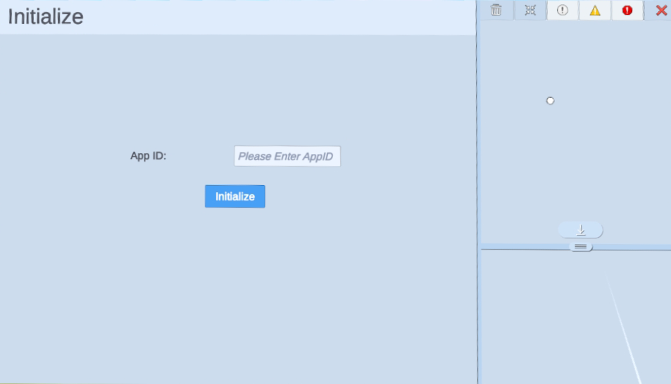
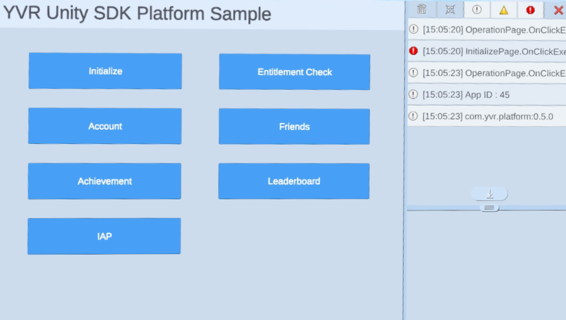

# 简介

YVR 平台的 SDk 旨在帮助开发者创建社交游戏体验。目前，它提供了以下功能：

-   [鉴权](./EntitlementCheck.md)：检查当前设备用户是否已经购买或拥有你的应用程序。
-   [账号与好友](./AccountAndFriends.md)：获取登录用户和好友信息。
-   [成就](./Achievement.md)：处理开发者在开发者中心仪表板上设置的成就。
-   [深度链接](./Deeplink.md)：深度链接允许用户加入多人游戏会话。
-   [排行榜](./Leaderboard.md): 对用户和朋友的分数进行排名，按升序或降序排列。
-   [内购](./IAPClient.md): 用户可通过充值Y币购买应用内的商品。
-   [运动数据授权](./SportsDataAuthorization.md)：获取用户运动数据的接口，应用可以通过数据来分析用户的运动情况。

## 入门

在使用任何平台功能之前，开发者首先需要初始化 Platform SDK：

```csharp
YVR.Platform.YVRPlatform.Initialize(<appId>);

if (YVRPlatform.IsInitialized)
    Debug.Log("Platform SDK is Successfully initialized.");
else
    Debug.LogError("Platform SDK initialize failed.");
```

> [!NOTE]
> 获得一个 AppID 之前，你需要先在我们的[开发者平台](https://developer.yvr.cn/yvrdvcenter/)上注册为开发者，然后创建你的应用程序。


## 示例

> [!Important]
> YVR 系统版本要求：1.2.6 及以上版本

请按照步骤导入示例项目。[平台示例](https://github.com/YVRDeveloper/PlatformSample-Unity)也可从 [YVR Developer Github](https://github.com/YVRDeveloper)获取。

1. 导入平台 SDK。 

2. 进入 **Window** > **Package Manager** > **Platform** > **Samples**，点击 **Import** 按钮导入平台示例。
    <br />
    

3. 在 **Project** 面板下，进入 **Assets** > **Samples** > **YVR Platform** > *[**platform version number**]*。选择 **Initialize** 文件夹下查看示例。 
    <br />
    
    <br />
    > [!Note]
    > 平台版本号取决于导入的版本，例如 0.5.1。

4. 构建并安装示例项目在 YVR 设备上。
    <br />
    
    <br /><br />
    