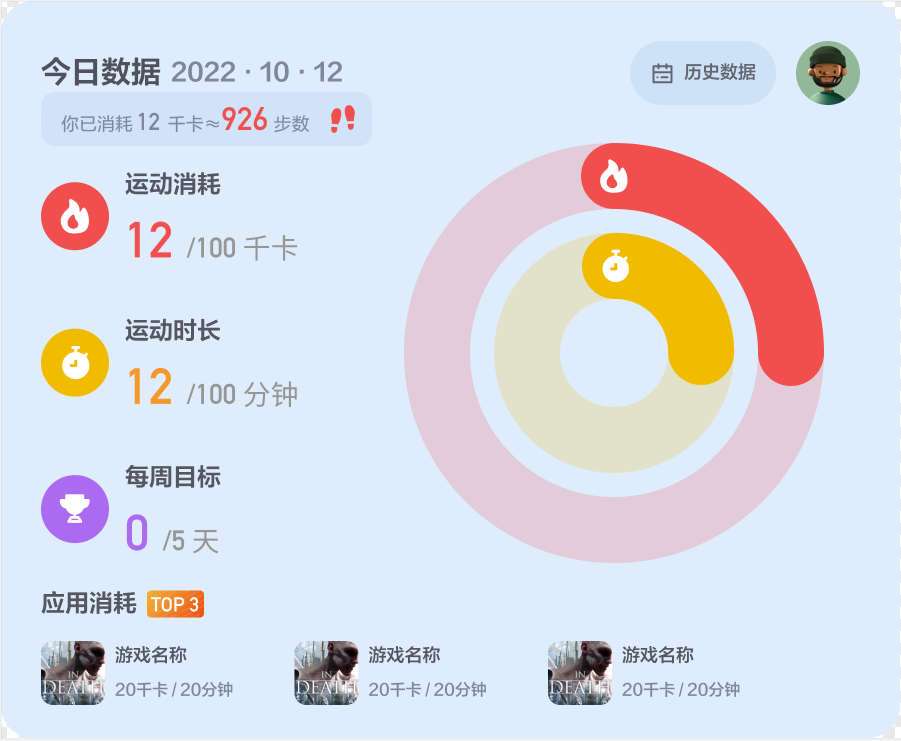

# 运动数据授权

“YVR GO” 是 YVR 系统的预装应用，用来采集用户使用 YVR 设备时所产生的运动数据，包括运动时长、运动消耗、应用偏好等。此外，用户可通过 “YVR GO” 来制定和管理运动计划。运动数据授权服务提供了从 “YVR GO” 获取用户运动数据的接口。YVR 系统上的运动类应用可以通过数据来分析用户的运动情况，从而为用户提供更好的定制化体验。
      
    

## 基本概念

| **概念** | **说明** |
| ------- | -------- |
| YVR GO | YVR 系统的内置应用，帮助用户管理运动计划。 |
| 运动计划 | 用户在运动中心设置的运动计划，包括运动时长、卡路里目标、每周运动天数等。 |

## 功能说明

| **功能** | **说明** | **使用场景** |
| -------- | ------- | ------------ |
| 读取用户基础信息和运动计划 | 身高、体重、年龄等信息 | 在应用内读取用户身高体重 |
| 读取用户某一时间段内的卡路里 | 1. 输入参数：开始时间、结束时间 2. 输出参数：卡路里、运动时长 | 1. 应用查询用户每天在当前应用的卡路里消耗和运动时长 2. 应用查询用户最近历史数据在当前应用得卡路里和运动时长 |

## 获取基础信息和运动计划

调用 `GetUserInfo` 来获取用户的基础信息和运动计划信息，包括：
- Gender: 男性=1，女性=2
- Birthday: 出生年份
- Stature: 以厘米为单位的自然身高
- Weight: 以千克为单位的体重
- PlanDurationInSeconds: 每天计划锻炼的时长（秒）
- PlanCalorie: 每天计划燃烧的卡路里
- DaysPerWeek: 每周计划锻炼的天数

## 获取今日运动数据

调用 `GetSummary` 获取 最近 24 小时内 任意时间段（查询的起始时间距离当前时间不得超过 24 小时）产生的运动数据，包括实际运动时长和实际消耗卡路里。

| **参数** | **说明** |
| -------- | --------|
| beginTime | 定义周期的开始时间 |
| endTime | 定义周期的结束时间 |

### 返回值

| **名称** | **类型** | **说明** | 
| -------- | ------- | -------- |
| DurationInSeconds | int | 运动时间（秒）。 |
| Calorie | double | 实际消耗的卡路里（单位：千卡）。 |

## 获取每日运动数据

调用 `GetDailySummary` 来查询用户 最近 90 天内 任意时期（查询起始时间不得早于 90 天前）产生的每日运动数据，包括实际运动时间、计划运动时间、计划卡路里消耗量和实际卡路里消耗量。

| **参数** | **说明** |
| -------- | --------|
| beginTime | 定义周期的开始时间 |
| endTime | 定义周期的结束时间 |

### 返回值

`SportDailySummaryList` 由 `SportDailySummary` 组成。若您设置的时间段为 2022/08/16 至 2022/08/18，则返回 08/16、08/17、08/18 的数据。

| **名称** | **类型** | **说明** | 
| -------- | ------- | -------- |
| Date | DateTime | 生成日期。 |
| DurationInSeconds | int | 运动时间（秒）。 |
| PlanDurationInMinutes | int | 计划运动时间（秒）。 |
| Calorie | double | 实际消耗的卡路里（单位：千卡）。 |
| PlanCalorie | double | 计划消耗的卡路里。 |