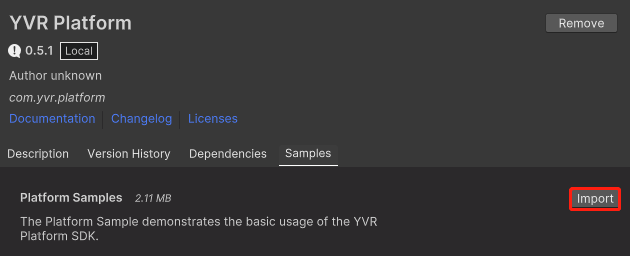
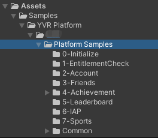
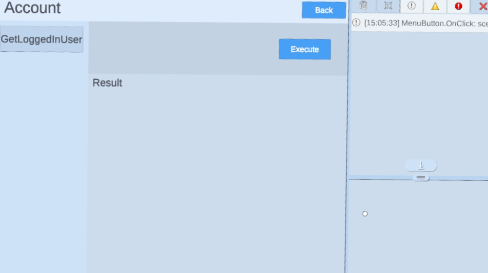
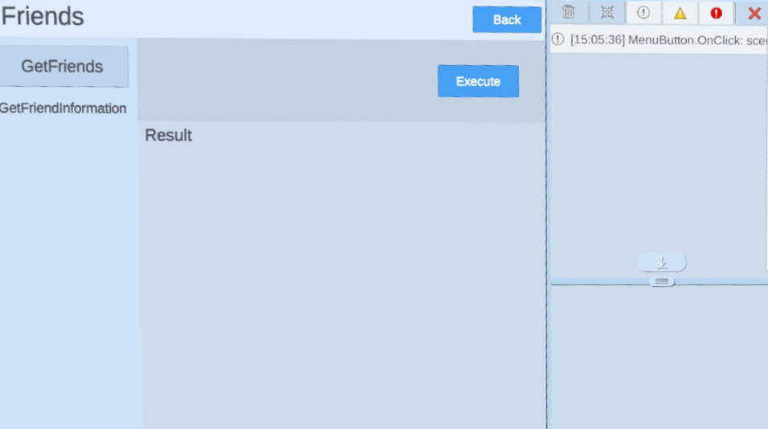

# Account and Friends

> [!Important]
> Before using any platform features, developers have to initialize Platform SDK first. Refer to [Platform](./Platform.md) for more information.

## Friends

Users can see friends' information in your application.

The following SDK methods can be called from your client app：

1. `YVR.Platform.Friends.GetFriends`: Retrieves information of all user's friends.
2. `YVR.Platform.Friends.GetFriendInformation`: Retrieves information about an appointed friend with account ID.

> [!Note]
> For more information, please refer to [Friends API Documentation](xref:YVR.Platform.Friend).

## Account

Once a user opens your application, you can get user's account information from your application.

1. `YVR.Platform.Account.GetLoggedInUser`: Get logged in user's account information.

> [!Note]
> For more information, please refer to [Account API Documentation](xref:YVR.Platform.Account).

## Sample

> [!Important]
> YVR system version requirement: 1.2.6 and above

Please follow the steps to import Sample Project. [Platform Sample](https://github.com/YVRDeveloper/PlatformSample-Unity) is also available at [YVR Developer Github](https://github.com/YVRDeveloper).

1. Import Platform SDK. 

2. Go to **Window** > **Package Manager** > **Platform** > **Samples**, select **Import** button to import Platform Samples.
     
    

3. Under **Project** panel, go to **Assets** > **Samples** > **YVR Platform** > *[**platform version number**]*. Select **Account/Friends** folder to view the sample project. 
     
    
     
    > [!Note]
    > The platform version number depends on the version you have imported, e.g. 0.5.1.

4. Build and install on YVR device. 
     
    
      
    