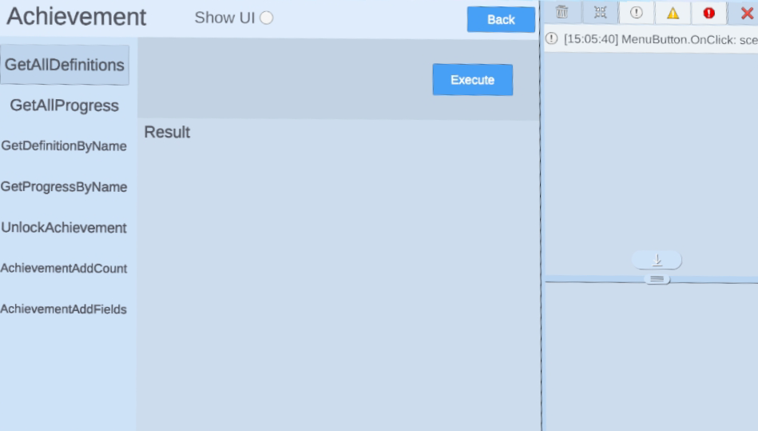

# Achievements

> [!Important]
> Before using any platform features, developers have to initialize Platform SDK first. Refer to [Platform](./Platform.md) for more information.

## Integrating Achievements

Once you’re finished creating the achievements, you can integrate them in your game. When you call the functions in this section, make sure to use the achievement name you specified on the developer dashboard.

1. `YVR.Platform.GetDefinitionsByName`: Retrieves information about a specific achievement, including achievement name, type, and target or bitfield length.
2. `YVR.Platform. GetProgressByName`: Retrieves information about a user’s progress on a specific achievement, including name, unlocked status, time that the achievement unlocked, current bitfield, and current count.
3. `YVR.Platform.GetAllDefinitions`: Retrieves information about all achievements, including achievement name, type, and target or bitfield length.
4. `YVR.Platform.GetAllProgress`: Retrieves information about a user’s progress on all achievements, including name, unlocked status, time that achievement unlocked, current bitfield, and current count.

The following SDK methods can be called for any achievement that has a Client Authoritative write policy.

1. `YVR.Platform.UnlockAchievement`: Unlock a specified achievement. This will completely unlock an achievement, including count and bitfield achievements, even if the target has not met. 
2. `YVR.Platform.AchievementAddCount`: Increment the count on a Count achievement.
3. `YVR.Platform.AchievementAddFields`: Unlock a bit in a Bitfield type achievement.

> [!Note]
> For more information, please refer to [Achievement API Documentation](xref:YVR.Platform.Achievement).

## Sample

> [!Important]
> YVR system version requirement: 1.2.6 and above

Please follow the steps to import Sample Project. [Platform Sample](https://github.com/YVRDeveloper/PlatformSample-Unity) is also available at [YVR Developer Github](https://github.com/YVRDeveloper).

1. Import Platform SDK. 

2. Go to **Window** > **Package Manager** > **Platform** > **Samples**, select **Import** button to import Platform Samples.
     
    

3. Under Project panel, go to **Assets** > **Samples** > **YVR Platform** > *[**platform version number**]*. Select **Achievement** folder to view the sample project. 
     
    
     
    > [!Note]
    > The platform version number depends on the version you have imported, e.g. 0.5.1.

4. Build and install on YVR device. 
     
    