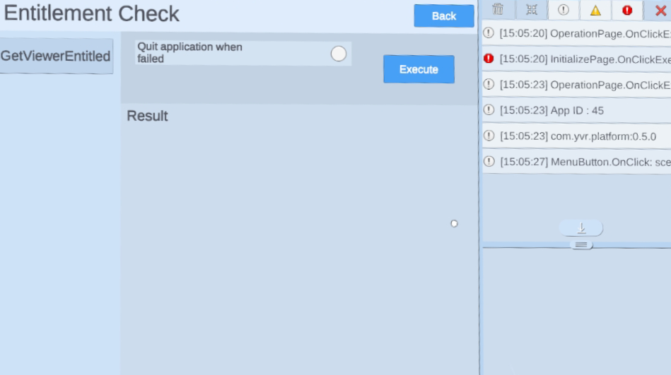

# Entitlement Check

> [!Important]
> Before using any platform features, developers have to initialize Platform SDK first. Refer to [Platform](./Platform.md) for more information.

Entitlement check is used to check whether the current device user has purchased or owned your application.

To meet YVR publishing requirement, developer has to do the check within 10 seconds after the program starts. For more details about publishing requirements, please refer to [VRC Requirements](https://developer.yvr.cn/yvrdoc/vrce/articles/Security1.html).

> [!Note]
> This check does not force users to be online while using the application. Even the device is offline, the check result is expected to be correct as long as the device has been online within 30 days.

## Perform the Entitlement Check

`GetViewerEntitled` API is used to check entitlement state, which is a async API: 

```csharp
YVR.Platform.PlatformCore.GetViewerEntitled().OnComplete(GetViewerEntitledCallback);

private void GetViewerEntitledCallback(YVR.Platform.YVRMessage<YVR.Platform.Entitlement> msg)
{
    if (msg.isError || !msg.data.isEntitled)
    {
        // Entitlement check failed. Quit app.
    }
}
```


## Sample

> [!Important]
> YVR system version requirement: 1.2.6 and above

Please follow the steps to import Sample Project. [Platform Sample](https://github.com/YVRDeveloper/PlatformSample-Unity) is also available at [YVR Developer Github](https://github.com/YVRDeveloper).

1. Import Platform SDK.

2. Go to **Window** > **Package Manager** > **Platform** > **Samples**, select **Import** button to import Platform Samples.
    <br />
    

3. Under Project panel, go to **Assets** > **Samples** > **YVR Platform** > *[**platform version number**]*. Select **Entitlement Check** folder to view the sample project. 
    <br />
    
    <br />
    > [!Note]
    > The platform version number depends on the version you have imported, e.g. 0.5.1.

4. Build and install on YVR device. 
    <br />
    
