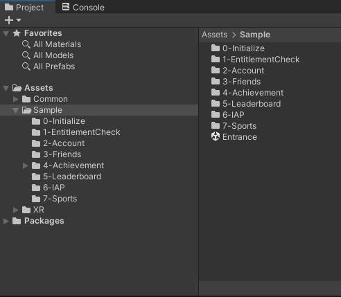

# Introduction

The YVR Platform SDK aims to help developers create a social game experience. For now, it provides the following features:

-   [Entitlement Check](./EntitlementCheck.md): Check used to check whether the current device user has purchased or owned your application.
-   [Account And Friend](./AccountAndFriends.md): Get logged user and users' friend information.
-   [Achievement](./Achievement.md): Handle achievements which set by developers on Developer center dashboard.
-   [Deep Link](./DeepLink.md): Deeplink allows users to join multiplayer session.
-   [Leaderboard](./Leaderboard.md): Ranking scores of users and friends, listing them in ascending or descending order.
-   [In-App Purchase](./IAPClient.md): User can purchase in-app items by topping up Y coins in user center.
-   [Sports Data Authorization](./SportsDataAuthorization.md): Obtain user sports data from "YVR GO", and sports apps can use the data to analyze the user's exercise.


## Get Started

Before using any platform features, developers have to initialize Platform SDK firstly:

```csharp
YVR.Platform.YVRPlatform.Initialize(<appId>);

if (YVRPlatform.IsInitialized)
    Debug.Log("Platform SDK is Successfully initialized.");
else
    Debug.LogError("Platform SDK initialize failed.");
```

> [!Note]
> In order to get an AppID, you need to first register as a developer on our [developer platform](https://developer.pfdm.cn/yvrdvcenter/) and then create your application.


## Sample

> [!Important]
> YVR system version requirement: 1.2.6 and above

[Platform Sample](https://github.com/YVRDeveloper/PlatformSample-Unity) is also available at [PlayForDreamDevelopers Github](https://github.com/PlayForDreamDevelopers).

1. Under Project panel, go to **Assets** > **Samples** folder to view the sample project. 
    <br />
    
    <br />

2. Build and install on YVR device. 
    <br />
    
    <br /><br />
    

